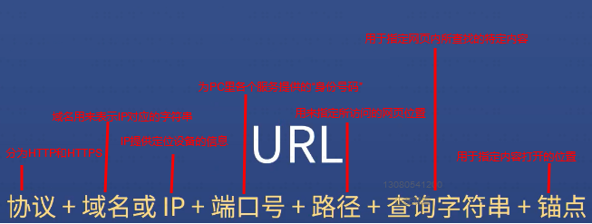
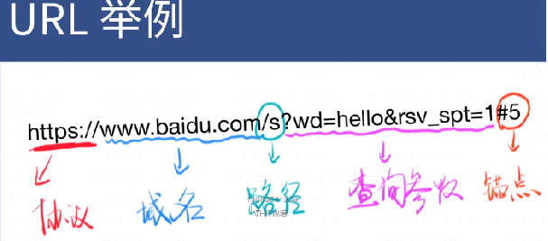
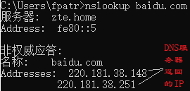
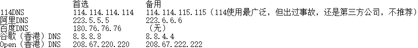
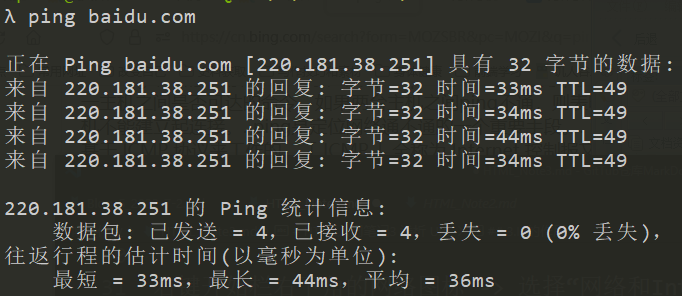

# HTML 入门笔记 3 浅析 URL

## 1.URL 简介

URL（Uniform Resource Locator）全称统一资源定位符，是用于指定网络信息位置的表示方法。

URL 一般显示在浏览器的网址栏中，必定包含协议、域名或 IP、端口号，还可以包含路径、查询字符串和锚点。其中，由于协议与端口号已经约定俗成一一对应，因此输入网址的时候端口号一般会默认省略，除非用户手动指定可用端口。

URL 各个部分作用见下图：

一个可用的 URL：

## 2.DNS 的作用

DNS（Domain Name System）全称域名系统，是将域名和 IP 一一对应的方法。

在控制台输入`nslookup + 域名`即可查看该域名对应的 IP 信息。

举例，在控制台输入`nslookup baidu.com`：

一个域名可以对应不同的 IP。

说到 DNS，当你的 DNS 故障，无法正常联网时，有个小技巧：

右键开始栏右下角的网络图标 -> 选择“网络和 Internet 设置” -> 选择更改适配器选项 -> 右键正在连接的 WLAN 或者以太网 -> 选择属性 -> 双击 Internet 协议版本 4（TCP/IPv4） -> 选择使用下面的 DNS 服务器地址　-> 从以下的 DNS 地址里选择一个填入：

## 3.IP 的作用

IP（Internet Protocol）指网际互连协议，是 TCP/IP 体系中的网络层协议，用于在网络上定位指定的网络设备。

ping 命令常常用于测试与目标 IP 连接的稳定性和速度，下面是`ping baidu.com`的例子。

此外，ping 命令还有很多强大的功能。有些开发者为了防止别人攻击自己的服务器，或者获得信息，会禁止 ping 功能，比如`ping qq.com`就得不到想要的结果。

## 4.域名是什么

域名也可以认为是 IP 的别称，一般对应 http 和 https 协议，是根据人的使用习惯将 IP 简化后的一列字符串，便于人的记忆和使用。

域名从级别来分，可以分为：

- 顶级域名（例如 com）
- 二级域名（俗称一级域名，例如 `baidu.com`、`bing.com`）
- 三级域名（俗称二级域名，例如 `www.baidu.com`、`cn.bing.com`)

下级域名和上级域名之间是父子关系。

要注意的是，`www.XXX.com` 和`XXX.com`是两个不同的域名，它们可以分属两个不同的公司。

注：本文部分图片源于饥人谷视频截图，版权属于饥人谷，不得用于盈利，非盈利转载请注明出处。
