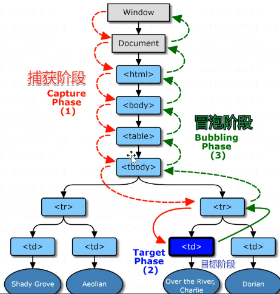

# JS DOM note 2 DOM 事件和事件委托

## 1 DOM 事件

### 1.1 捕获和冒泡

在事件监听的调用顺序上，IE 和网景之间曾经有过争执。IE 支持从子元素到父元素的调用顺序，而网景则支持从父元素到子元素的调用顺序。

2002 年，W3C 发布文档 DOM Level 2 Events Specification，终结了这场争执。

该文档规定，浏览器应该同时支持两种调用顺序，先按 父元素->子元素 的顺序检查和执行，再按 子元素->父元素 的顺序检查和执行。至于到底要将函数调用放在哪个阶段，由开发者自己决定。

为了便于理解，从外向内检查监听函数，被称为事件捕获；从内向外检查监听函数，称为事件冒泡。即浏览器先走捕获，再走冒泡：

```JS
//W3C事件模型
先捕获（先父元素->子元素）再冒泡（再子元素->父元素）
```

可以通过 DOM 事件模型流程图来理解这个过程：



那么，开发者如何决定监听函数的调用顺序呢？

代码标准如下，当`bool`值为 true 时，fn 将会走捕获顺序；当`bool`值不写或者为 falsy 时，fn 将会走冒泡顺序：

```JS
div.addEventListener('click', fn, bool)
```

返回事件的目标节点，可以用`.target`或`.currentTarget`，案例如下：

```JS
div1.addEventListener('click', (e) => {
    const t = e.target  //.target 用户操作
    if(t){
        console.log('div1')
        console.log(t)
    }
})
div2.addEventListener('click', (e) => {
    const t = e.currentTarget  //.currentTarget 开发者监听
    if(t){
        console.log('div2')
        console.log(t)
    }
})
```

目前为止，浏览器自带的事件共有 100 多种，详情可查阅 MDN 事件索引或其他标准资料。

### 1.2 取消冒泡的方法及限制

首先确定一点，捕获阶段是不可取消的，但是冒泡阶段可以。

在监听函数中输入`e.stopPropagation()`即可取消冒泡。

代码示例如下：

```JS
son.addEventListener('click', (e) => {  //打印出 sonTest
    console.log('sonTest')
})
parent.addEventListener('click',  (e) => {  //打印出 parentTest 后中断
    e.stopPropagation()
    console.log('parentTest')
})
grandpa.addEventListener('click',  (e) => {  //无法打印
    console.log('GrandpaTest')
})
```

但取消冒泡的方法对于某些特定情况无效：

- 规定不可取消冒泡的事件，比如`scroll`。
- 自定义事件不可取消冒泡。

取消冒泡的方法一般用于封装某些独立组件。

#### 扩展：阻止滚动

scroll 无法取消冒泡，那么在我们需要的时候，该如何强制中断它呢？

PC 阻止滚动，需要同时阻止滚轮和拖动条：

```JS
//取消滚轮
div.addEventListener('wheel', (e) => {
    e.preventDefault()
})
```

```CSS
/*拖动条宽度设为0*/
::-webkit-scrollbar {
    width: 0 !important
}
```

手机端可以通过阻止触屏来阻止滚动：

```JS
div.addEventListener('touch start', (e) => {
    e.preventDefault
})
```

当然，还有其他取消滚动的方法，这里就不赘述了。

### 1.3 自定义事件

举例，为 button 添加冒泡事件：

```JS
button.addEventListener('click', ()=>{
  const event = new CustomEvent("cat", {
    "detail":{name:'cat', age: 18},
    bubbles:true
  })
  button.dispatchEvent(event)
})

button.addEventListener('cat', (e)=>{
  console.log('cat')
  console.log(e.detail)
})
```

## 2 事件委托

在开发中，常常会遇到这样那样的需求。比如说，需求要求给 100 个按钮添加点击事件；又比如说，要求你监听目前不存在的动态元素。

这些需求的实现要么是天方夜谭，要么需要耗费海量的工作量，要么会让网页变得奇卡无比。

但是事件委托的出现，给了这些难题一个新的解决方案：**监听祖先元素**。

监听祖先元素，用事件委托控制多个子元素：

```JS
div.addEventListener('click',(e)=>{ //监听祖先元素，为所有子元素绑定事件
  const t = e.target;
  if(t.tagName.toLowerCase() === 'button'){
    console.log("点击事件触发");
  };
});
let name = "id-1"
div.addEventListener('click',(e)=>{ //监听祖先元素，为指定id的子元素绑定事件
  const t = e.target;
  if(t.dataset.id === name){
    console.log('点击的button的id为' + t.dataset.id);
  };
});
```

监听祖先元素，用事件委托控制目前不存在的动态元素：

```JS
setTimeout(()=>{
  const button = document.createElement('button');
  button.textContent = 'click 1';
  div1.appendChild(button);
},1000);


div1.addEventListener('click',(e)=>{
  const t = e.target;
  if(t.tagName.toLowerCase() === 'button'){
    console.log('button 被点击了');
  };
});
```

比起直接监听所有子元素，监听祖先元素即省内存又省工作量，而且还能解决许多以前难以解决甚至无法解决的问题。
