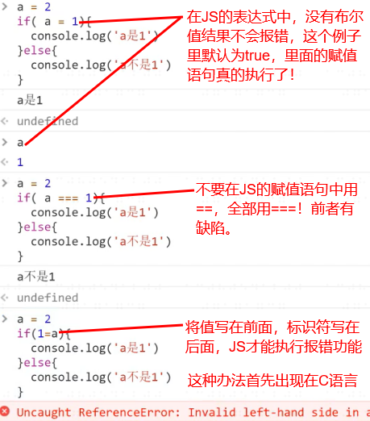

# JavaScript Beginner Note 2 JavaScript 基本语法

JavaScript 是一门很有趣的语言，程序员恶评如潮，JS 却稳如泰山。但一门语言的价值，并不会因评价而改变。JS 能够适应需要它的场景，发挥其独特作用，因此成为了世界上使用最广的高级语言。对于工作来说最重要的是价值，而不是所谓的美不美。

学习前端还需要注意一点，后端可能会其他语言，同时还会一些 JS；但前端可能只会 JS，这会导致目光狭隘。

永远不要只学一门语言。

## 1.基础组成：表达式、语句、标识符和注释

### 1.1 表达式（expression）和语句（statement）

表达式是以得到返回值为目的的计算式，可以单独存在，也可以作为语句的组成部分。

表达式举例：

```JavaScript
console.log('hello world')
```

语句是程序为了某个目标而进行的操作。

赋值语句举例：

```JS
let name = 'aMo'
```

相关知识：  
1.表达式一定有值，而语句可能会给出值也可能不会。  
2.语句很可能会改变环境（声明、赋值等）。  
3.返回值和值是不同的；在 console.log(x)里，无论 x 为什么字符，返回值都是 x，值都是 undefined。  
4.JS 大小写敏感。  
5.在不影响断句的前提下，空格和回车的使用几乎不会影响程序。  
6.回车与空格有一点不同，回车绝对不能出现在 return 和需要返回的值之间！

### 1.2 标识符（identifier）

标识符指的是用来识别各种值的合法名称，常见的标识符有变量名和函数名。

标识符的命名规则是：

- 第一个字符，可以是任意 Unicode 字母（包括英文字母和其他语言的字母，甚至中文），以及美元符号（$）和下划线（\_）。
- 第二个及以后的字符，除了前面提到的所有字符之外，还可以用数字 0-9。
- 标识符命名不能用保留字。

合法的标识符举例：

```JS
let arg0
let _tmp
const $elem
var π
var ⅠⅡⅢⅣ//这里用的是罗马数字1~4，这完全合法！
```

非法的标识符举例：

```JS
let 1a //首字符不能是数字
const No!@#%^&*()_+-= //不能包含除$和_以外的非语言特殊字符
```

在工作当中，标识符的命名一般要遵循以下要求：  
1.尽可能使用语义明确的英文。  
2.下划线最多连续使用 2 个。  
3.实在找不到合适的英文时，可以直接用中文命名，但严禁用拼音命名！拼音很容易造成歧义。

### 1.3 关于注释

注释的写法很简单：

```JS
console.log('这里是程序') //这是单行注释
```

```JS
/*
这是多行注释
*/
```

写好注释是一门技术活，注释杂而乱会掩盖真正重要的信息，要降低信噪比。

- 糟糕的注释常常是：单纯把标识符翻译成中文、不合时宜的注释、或者发泄情绪的内容。
- 优秀的注释一般是：踩坑注解，或者记录了“为什么要这么做”的信息。比如特殊的 bug，比如客户或领导奇怪的需求。

## 2.判断语句

### 2.1 if 判断语句

JS 中，最常见也最基础的判断语句是 if 语句，常见语法结构如下：

```JS
if (表达式){
    语句1
} else {
    语句2
}
```

当某个语句只有一行时，可以省略{}，写成这样：  
`if (表达式) 语句1 else 语句2`

但实际操作中省略{}的行为不仅毫无意义，还大幅降低了可阅读性。

{}的作用在于，将几个语句变成一行，没有{}会出现歧义。对此，有一种常见的面试题类型：

```JS
/*
以下语句的返回值是什么？
A.a等于2  B.a a等于2  C.没有返回值  D.undefined
*/
a = 1
if(a === 2)
    console.log('a')
    console.log('a等于2')
```

正确答案是 A。

### 2.2 扩展知识

1.如果 if 语句的表达式错写为赋值语句，表达式结果不是布尔值，if 语句也会执行，并且不会报错:



更糟糕的是，都 2022 年了，VSCode 也不会报错，只有 WebStorm 才能正常报错。

2.JS 中，常用的判断方法还有 switch 语句、三元表达式和短路逻辑，它们的常见格式如下：

```JS
//switch语句
switch (fruit) { //会根据输入的fruit选择性的执行语句
    case "banana":
        语句1
        break;
    case "apple":
        语句2
        break;
    default:
        语句3
}

//三元表达式
表达式1 ? 表达式2 : 表达式3 //若表达式1为非假，执行表达式2；若表达式1为假，执行表达式3

//短路逻辑
A && B && C //若&&前存在假值，执行第一个值为假的语句；否则，执行最后一个语句
D || E || F //若||前存在真值，执行第一个值为真的语句；否则，执行最后一个语句
```

## 3.循环语句

### 3.1 while 循环

JS 中，最基础的循环语句是 while 循环，其基本结构如下：

```JS
//为了方便与for循环的语句结构对比，将赋值语句和增长语句也算了进来
赋值语句
while(表达式){
    循环体
    增长语句
}
```

有些可惜的是，由于 while 循环存在一个奇怪的返回值 bug，因此大家在能不用 while 循环的场景，都会尽可能避免用 while 循环。

### 3.2 for 循环

for 循环的基本结构如下：

```JS
for(赋值语句; 表达式; 增长语句){
    循环体
}
```

若在赋值语句中使用`let i = 0`，则循环结束后，i 会被销毁。

若使用`var i = 0`赋值，则循环结束后，可以在 for 循环外面继续使用 i。

### 3.3 for 循环中的 setTimeout

运行以下代码，控制台会输出什么：

```JS
for (var i = 0; i<5; i++) {
    setTimeout(()=>{
        console.log(i)
    })
}
//输出结果为5个5
```

假设循环次数增加到 1 亿，输出的 i 也一定会是 1 亿个 1 亿，只是浏览器不一定能正常把结果输出来。这是由 setTimeout 的特殊状态决定的。

但是，如果将以上代码中的 `var i = 0` 替换为 `let i = 0`，setTimeout 的特殊就不奏效了，它会依次正常的返回 0~4 的结果。

### 3.4 break 和 continue

使用循环嵌套判断语句时，为了保证在一定条件下，循环能够提前结束，我们会使用 break 和 continue。

break 用于跳出当前循环：

```JS
for(var i = 0; i<10; i++){
    if(i%2 === 1){
        console.log(i)
        break
    }
}
//只会返回1。
```

continue 用于立即终止本轮循环，返回 for 循环头部进入下一轮循环：

```JS
for(var i = 0; i<10; i++){
    if(i%2 === 1){
        continue
    }else{
        console.log(i)
    }
}
//返回5个数字，分别是0、2、4、6、8。
```

### 3.5 label

label 是个很尴尬的语句，除了用来做考点外毫无用处，但是我们需要面对面试。

我们需要知道的有两种状态：

```JS
{
    xxx: yyy //该语句在Chrome输出异常，在此处加分号会恢复正常
}
//该语句正常情况下会输出yyy。
//该语句不是对象。
```

```JS
var a = {
    foo: 1
}
a
//a会被执行，label语句此时是一个对象。
```
