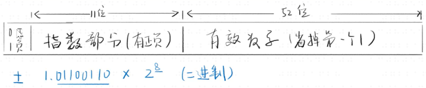

# JavaScript Beginner Note 3 JavaScript 数据类型

在正式学习数据类型之前，首先要确认电脑数据的基本存储单位和方式：字节、比特和二进制。

比特（bit）是二进制数字 （binary digit）的缩写，每个 0 或 1 就是一个比特，8 个比特组成一个字节。所有十进制数字、字符、图片等等，都是由一个个二进制数字组成的。

实际操作时，为了提高效率，会用十六进制数字来表示二进制数字。

电脑是没法分清楚字符'1'和数字 1 的，它要通过诸如文件后缀、行间规则等等方法，来判断信息读取的方式。

在字符规则方面，JS 的每个字符是固定两个字节，属于阉割版 Unicode 库。这是由于 JS 被发明的时候，Unicode 还没有一个可用版本。

## 1.七个数据类型

JS 有且只有七个数据类型，分别是：

- number 数字
- bool 布尔值
- string 字符串
- symbol 符号
- undefined 空
- null 空
- object 对象

有一个便于记忆这七种数据类型的总结：四基（本）两空一对象。

接下来，我对 JS 里最常用的三种基本类型作一下简介。

### 1.1 number 数字

数字在 JS 里的基本存储，使用的是 64 位浮点数。其中，正负符号占据一位，指数占 11 位（-1023~1024），有效数字占 52 位（开头的 1 省略）。



受限于 number 的存储方式，JS 里的数字有大小和精度极限。一般而言，包含小数点前后 15 位以内的数字，或者是 16 位 90 以下开头的数字，JS 都能精确表示。

数字在 JS 中几种常见的不同写法分别是：

- 整数写法 123 / 8 / 114514
- 小数写法 0.123 / 0.314159265354
- 科学计数法 1.23e4 / 3.14e-1
- 八进制 0123 / 00123 / 0o123 （八进制 0/00/0o 开头）
- 十六进制 0x3F / 0X4F （十六进制 0x/0X 开头）
- 二进制 0b11 / 0B11 （二进制 0b/0B 开头）

此外，JS 数字中常见的特殊值有：

- 无穷大，包括 Infinity、+Infinity、-Infinity
- +0 和-0，在参与运算的时候可能会有不同的结果，比如：  
  1/0 = 1/+0 = Infinity = +Infinity  
  1/-0 = -Infinity
- NaN（Not a Number）的意思是无法表示的数字，它在 JS 中属于数字类型，它可能出现在以下的运算中：  
  0/0 = NaN

### 1.2 string 字符串

在 JS 中表达字符串，有三种标准写法，包括` '单引号'``"双引号" `和`反引号`。

其中，反引号是 ES6 引进的。单双引号包裹的字符串中想处理换行非常麻烦，而反引号包裹时只需要正常换行即可。

如果要在字符串中表达引号，可以用不同引号包裹或者转义的方法。

不同引号包裹是指，有双引号的内容用单引号包裹，有单、双引号的内容则用反引号包裹，就不会引起异常。

转义是指，用另一种写法来表示特殊字符。

```JS
//'it's ok' //错误写法
"it's ok"//不同引号包裹的正确写法
'it\'s ok'//转义的正确写法
```

常用转义方式如下：

- `\'` 单引号'
- `\"` 双引号"
- `\n` 换行
- `\r` 回车
- `\t` tab
- `\\` 反斜杠\

在 JS 中，字符串是有属性的。其常用的属性和对应方法有三类：

1.长度

字符串长度通常用 string.length 读取，如：

```JS
'123'.length //3
'\n\r\t'.length //3
' '.length //1
''.length //0
```

2.下标

JS 字符串的下标是从 0 开始，即长度为 length 的字符串，其第一个字符下标是 0，最后一个字符下标是 length-1。

这里只介绍通过下标读取字符的方法，string[index]：

```JS
let a = '123'
a[0] //'1'
let b = '\n\r\t'
b[2] //'\t'
let c = ' '
c[1] //undefined，下标超出上限也不报错！
```

使用 JS 时要注意一个重点，读取字符的下标超过上限时，它会返回 undefined，并不会报错！所以遇到读取下标的场景，一定要手写检测代码，并测试通过！

3.base64 转码

常用于隐藏个人信息，但对稍微懂行的人都完全无效。

```JS
window.btoa('123') //对信息编码，返回"MTIz"
window.atob("MTIz") //对地址反编码，返回"123"
```

#### 扩展知识：从 ASCII 到 UTF-8

最初的字符编码标准是 1967 年由美国制定的 ASCII 编码，每个编号用一个字节，基本涵盖了键盘上的所有键位。

后来，各个国家的人也开始使用电脑，制定属于自己的标准。中国国家标准局于 1980 年制定了一个标准，名为国标 2312，用两个字节表示一个汉字。

两个字节原本可以表达 16^2=65536 个字符，但是国标 2312 只收录了 6000 多个字符，大量生僻字、繁体字都未收录，再加上十几年里既没有更新也没有新的标准，为政府和企业工作留了许多麻烦。这些问题直到 1995 年，GBK 出现才得以解决。

随着互联网的开放，统一各个全球字符标准的任务愈发迫切。1996 年 7 月，经过将近 9 年的激烈讨论，第一个稳定的 Unicode2.0 版本发布。Unicode 正式版的发布带来了一个新问题，由于字符过多，Unicode 采取了三个字节对应一个字符的编码形式，但主要使用的字符都是一到两个字节，再加上当时主流电脑的内存条才不过几 M，空间的浪费成为了一个亟需解决的问题。

为了解决空间浪费的问题，基于 Unicode 的可变长度字符编码 UTF-8 应运而生，它在 1993 年正式发布。截至 2019 年 11 月，在所有网页中，UTF-8 编码应用率高达 94.3%。

### 1.3 bool 布尔值

布尔值只有两个，true 和 false。

将逻辑运算的 true 和 false 命名为布尔值，是为了纪念发明逻辑运算的乔治·布尔先生。

逻辑运算（布尔运算）常用的有三类：

```JS
!true  //否定运算，结果为false
1==2  1!=2  3===4   3!==4   //相等运算，结果依次为false、true、false、true
1>2  1>=2  3<4  3<=4    //比较运算，结果依次为false、false、true、true
```

布尔值最常用的地方在于 if 语句，但是 JS 的 if 语句判断，不止可以判断 bool 值。

在`if(value)`中，如果 value 不是 bool 值，则会判断是否属于相当于 false 的值，这种值在 JS 中有 5 个，被称为 5 个 falsy 值`undefined`、`null`、`0`、`NaN`、`''`。

## 2.变量与常量声明

声明必须遵循标识符命名规则（详见 Note2 JavaScript 基本语法）。

JS 中有三种声明方式：

```JS
var a = 1 //过时、不好用的声明方式
let a = 1 //新的，更合理的声明方式
const a = 1 //新的常量声明方式
a = 1 //无声明词可以用于声明全局变量是一种错误的谣言，是由于JS历史原因没有修复的一种bug，严禁使用！
```

### 2.1 let 和 const

let 有很多特点：

- 遵循块作用域（使用范围不会超出{}）
- 不能重复声明
- 声明时可以赋值或不赋值
- 必须先声明再使用
- 声明的 let 变量不会变成 window 的属性

const 拥有 let 的所有特征，除了两点：

- 声明时必须立刻赋值
- 赋值后无法更改

### 2.2 var

var 有很多缺点，比如 var 声明的属性，会自动变成 window 的属性，可以重复申明（不包括 let 和 const 声明的标识符），无法声明常量等等。

在新的声明词出现之后，var 不应再使用。

## 3.类型转换

在 JS 中，变量的值和类型是可以随时转换的。这里简单讲一下除了对象之外其他类型的常用转换方法。

### 3.1 number => string

`String(n)`方法实际工作中用得少：

```JS
String(1) //'1'
```

`n+''`方法，常用：

```JS
123 + '' //'123'
```

这两个方法都有一个问题，当数字的位数超过 21 个的时候，它会把数字变成科学计数法，再转为字符串：

```JS
String(1000000000000000000000) //'1e+21'
10000000000000000000000 + '' //'1e+22'
```

### 3.2 string => number

`Number(n)`方法，实际工作中用得少：

```JS
Number('234') //234
```

减法或赋正号方法，常用：

```JS
'998' - 0 //998
+'98' //98
```

`parseInt`方法，该方法在 ES6 前的版本需要在字符串后面加 10，否则在字符串开头有 0 时，会误判为 8 进制数字。实例如下：

```JS
parseInt('0123',10) //123
parseInt('0123') //ES6前这样写会返回83，ES6后返回123
```

### 3.3 xxx => bool

虽然 JS 有自动转换功能（详见本章 1.3 布尔值），但是我们也可以将非布尔值手动变成布尔值。

正规但是用得少的方法：

```JS
Boolean(1) //true
Boolean('abc') //true
Boolean(null) //false
```

实际工作中，一般这么做：

```JS
!!1 //true
!!'abc' //true
!!null //false
```

### 3.4 xxx => string

这一节其实很废话，只介绍了一个用处小而且 bug 重重的.toString()，这也是我很疑惑为什么会单独拿出来讲。

更离谱的是，其他类型转 string 全都可以用 3.1 中数字转字符串的方法，并且没有.toString 的两个问题：

1.将非字符串转化字符串时，有一个 bug，整数后面不能直接接加.toString()，必须用括号，或者多加一个点，或者多加一个空格。

2.使用.toString 无法转换 undefined 和 null，而 3.1 里的两个方法全都可以正常转换。

### 扩展知识

对于 JS 的诸多 bug，程序员总结了不少解决办法，并汇集到了一个网站，这个网站就是**JS 秘密花园**，作者是伊沃·韦特泽尔（撰写）和张易江（设计）。
