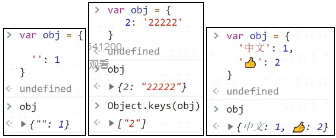
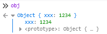
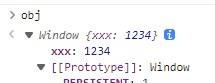

# JavaScript Beginner Note 3 JS 对象基础

对象（Object）是第七种数据类型，也是唯一一种复杂类型。之所以称为复杂类型，是因为对象可以任意包含前六种数据类型。当然，对象也包含对象自己。

## 1.对象的语法

声明对象的语法有两种：

```JS
let obj1 = new Object({'属性名': '属性值'}) //标准写法
let obj2 = {'键名': '键值'} //实际工作多用这种
```

键名不会重复，且一定会是字符串（ES6 新增 symbol 作为键名）。虽然显示形式不同，以下图片中的键名都是字符串：



### 1.1 匿名对象

创建一个对象，但是不赋给任何一个标识符，这种对象叫做匿名对象，在创建并使用完后就会立即销毁，下面举个例子：

```JS
console.log({'name': 'frank'}) //打印{"name": "frank"}后即刻销毁
```

### 1.2 键名字符串化的特殊情况

前一篇 blog 提到，在数字位数过多的时候，JS 会将数字自动变为科学计数法：`String(1000000000000000000000) //'1e+21'`，而有效位数小于 21 位的科学计数法，也会被 JS 自动变回数字。

将键值一一对应，可以看到对应键名发生了怎样的变化：

```JS
let obj3 = {
    1e2: '一', 1e-2: '二', 1e300: '三', .234: '四', 0101: '五', 0xFF: '六',
}

obj3
/*返回
{
    "65": "五",
    "100": "一",
    "255": "六",
    "0.01": "二",
    "1e+300": "三",
    "0.234": "四"
}
*/
```

因此，在声明或增/改对象时，最好采用引号包裹键名的方式，避免出现 bug。

### 1.3 变量值作为属性名

要注意一点，所有的方法都是将变量的值传递作为属性名，

在 ES6 之前，想用变量值作属性名，需要利用 obj 下标即键名的特性：

```JS
let a = 'xxx'
let obj4 = {}
obj4[a] = 1234
obj4 //{"xxx": 1234}
```

ES6 之后，简化为以下步骤：

```JS
let a = 'xxx'
let obj5 = { [a]: 1234}
obj5 //{"xxx": 1234}
```

### 1.4 原型

JS 中每一个对象都有一个隐藏属性，该隐藏属性存储着其共有属性组成的特殊对象的地址，这个特殊对象被叫做原型。

统一原型的地址名叫做`__proto__`。一些浏览器已经改名，但仍然可以用`__proto__`操作，可以在浏览器的工作台中点开任意对象查看：




## 2.对象的增删改查

前面谈了如何创建对象，这里开始谈对对象的增删改查操作。为了便于理解，我以查、删、增改的顺序安排。

### 2.1 查属性

#### 2.1.1 查看所有属性

我们创建一个对象`obj6`，以该对象为例：

```JS
let obj6 = { name: 'world', age: 5e9}
obj6 //查看自身所有属性，结果太长不一一打出
Object.entries(obj6) //查看自身所有属性
Object.keys(obj6) //查看自身属性的属性名/键名
Object.values(obj6) //查看自身属性的值/键值
console.dir(obj6) //打印自身+原型/共有属性
obj6.__proto__ //查看自身的原型/共有属性
```

掌握了这些方法之后，我们就可以看到原型的原型是 null：

```JS
console.dir(obj6.__proto__.__proto__) //null
```

#### 2.1.2 查看指定信息

此外，想要检查一个属性是否属于自身，有两种做法，以之前的 obj6 为例：

```JS
'name' in obj6 //true
'toString' in obj6 //true
'world' in obj6 //false
obj6.hasOwnProperty('name')//true
obj6.hasOwnProperty('toString')//false
obj6.hasOwnProperty('world')//false
```

**注意上图的结果差异，`'name' in obj6`会检查自身+共有属性，而`obj6.hasOwnProperty('name')`只会检查自身属性不会检查共有属性。**

确定了属性名后，我们就可以根据属性名来查看属性值，以之前的 obj6 为例：

```JS
obj6['name'] //'world'，也可写为 obj6["name"] 或obj6 [`name`]
obj6.name //'world'，.语法不能包含变量，等价于上一句

let name = 'age'
obj6[name] //'50 0000 0000'，中括号语法可以包含变量
obj6.['age'] //'50 0000 0000'
obj6.age //'50 0000 0000'
```

**重点：由于中括号语法可以包含变量，所以使用中括号时，必须要明确分清楚，加分号是字符串！不加分号是变量！**

### 2.2 删除属性

删除属性分两个步骤，第一步是删除，第二步是检查。

删除一般使用`delete obj.xxx`的形式：

```JS
let obj7 = { name: 'world', age: 5e9}
delete obj7['name'] //true
delete obj7.name //true，即使删除不存在的属性，返回值也不变

let name = 'age'
delete obj7[name] //true，与查属性同理，中括号的形式也可以处理变量
```

从上面的返回值可以看出问题，由于删除一个不存在的属性时，返回值与正常删除成功的一模一样，因此删除以后我们还需要检查是否确实删除成功。

检查已删除的属性可以使用 2.1 里检查一个属性是否属于自身的两种办法，以检查属性`'name'`为例，可以用`'name' in obj`或`obj.hasOwnProperty('name')`，返回 false 即删除成功，这里不再赘述。更推荐用后一种方法。

### 2.3 增、改属性

增加和修改属性是几乎完全相同的，无则增有则改。方法主要有以下几种：

```JS
//创建：
let obj8 = {name: 'world', age: 5e9}
obj8 //{name: 'world', age: 50 0000 0000}

//单独修改：
obj8.name = 'Marry'
obj8['age'] = '18'
obj // {"name": "Marry","age": "18"}

//单独增加，与修改相同：
let new = 'gender'
obj8.new = '男'
obj8 //{"name": "Marry","age": "18","gender": "男"}

//批量增改，ES6新增方法：
Object.assign(obj8, {name: 'nuonuo', age: 20, gender: "女"})
obj8 //{"name": "nuonuo", "age": "20", "gender": "女"}
```

可以看到，涉及到单独修改和增加时，中括号的格式与上面是相同的，这个易错的重点要记住！

此外，通过`obj.__proto__`路径，原型（共有属性）也是可以进行增删改查操作的，但对共有属性进行增删改操作非常危险。

实在是工作需要，涉及到修改共有属性，只能用 ES6 新增的`Object.create()`：

```JS
let common = {'国籍': '中国'}
let person = Object.create(common) //将common作为原型创建person
```

即在创建一个对象时就安排好原型链，中途修改共有属性很影响性能。
